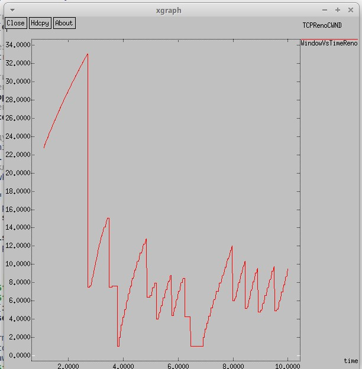
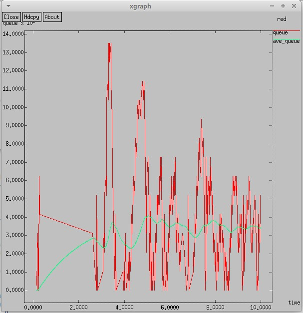
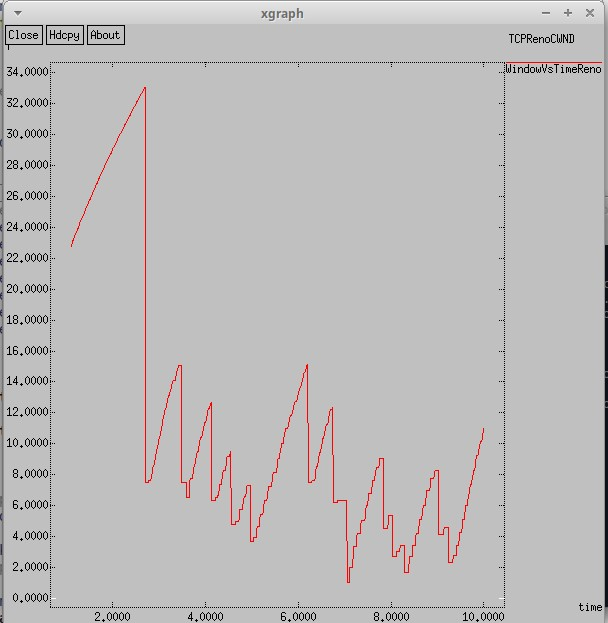
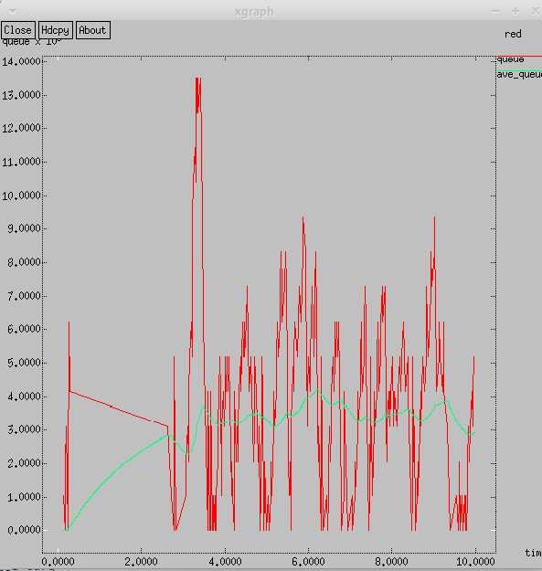
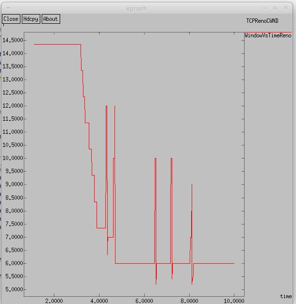
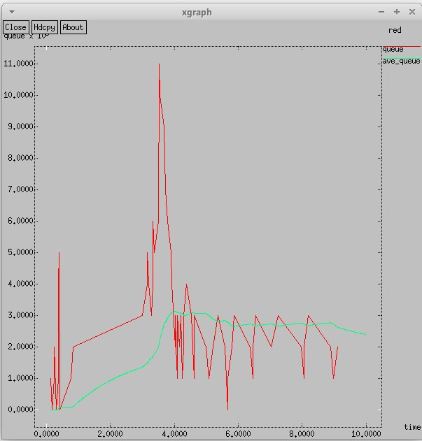
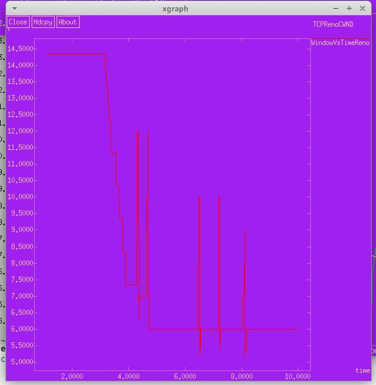
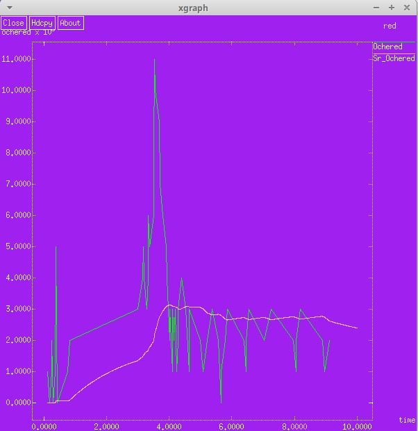

---
## Front matter
lang: ru-RU
title: Лабораторная работа 2
subtitle: Исследование протокола TCP и алгоритма управления очередью RED
author:
  - Алади П. Ч.
institute:
  - Российский университет дружбы народов, Москва, Россия

## i18n babel
babel-lang: russian
babel-otherlangs: english

## Formatting pdf
toc: false
toc-title: Содержание
slide_level: 2
aspectratio: 169
section-titles: true
theme: metropolis
header-includes:
 - \metroset{progressbar=frametitle,sectionpage=progressbar,numbering=fraction}
 - '\makeatletter'
 - '\beamer@ignorenonframefalse'
 - '\makeatother'
---

# Информация

## Докладчик

:::::::::::::: {.columns align=center}
::: {.column width="70%"}

  * Алади Принц Чисом
  * студент
  * Российский университет дружбы народов
  * [103225007@pfur.ru](mailto:1032225007@pfur.ru)
  * <https://pjosh456.github.io/>

:::
::: {.column width="25%"}

:::
::::::::::::::

## Цель работы

Исследовать протокол TCP и алгоритм управления очередью RED.

## Задание

1. Выполнить пример с дисциплиной RED;
2. Изменить в модели на узле s1 тип протокола TCP с Reno на NewReno, затем на
Vegas. Сравнить и пояснить результаты;
3. Внести изменения при отображении окон с графиками (изменить цвет фона,
цвет траекторий, подписи к осям, подпись траектории в легенде).

## Выполнение лабораторной работы

{#fig:001 width=50%}

## Выполнение лабораторной работы

{#fig:002 width=40%}

## Изменение протокола TCP

{#fig:003 width=40%}

## Изменение протокола TCP

{#fig:004 width=40%}

## Изменение протокола TCP

{#fig:005 width=40%}

## Изменение протокола TCP

{#fig:006 width=40%}

## Изменение отображения окон с графиками

{#fig:007 width=40%}

## Изменение отображения окон с графиками

{#fig:008 width=40%}

## Выводы

В процессе выполнения данной лабораторной работы я исследовал протокол TCP и алгоритм управления очередью RED.

