---
## Front matter
lang: ru-RU
title: Лабораторная работа 6
subtitle:  Модель M|M|1|
author:
  - Алади П. Ч.
institute:
  - Российский университет дружбы народов, Москва, Россия

## i18n babel
babel-lang: russian
babel-otherlangs: english

## Formatting pdf
toc: false
toc-title: Содержание
slide_level: 2
aspectratio: 169
section-titles: true
theme: metropolis
header-includes:
 - \metroset{progressbar=frametitle,sectionpage=progressbar,numbering=fraction}
 - '\makeatletter'
 - '\beamer@ignorenonframefalse'
 - '\makeatother'
---

# Информация

## Докладчик

:::::::::::::: {.columns align=center}
::: {.column width="70%"}

  * Алади Принц Чисом
  * студент
  * Российский университет дружбы народов
  * [103225007@pfur.ru](mailto:1032225007@pfur.ru)
  * <https://pjosh456.github.io/>

:::
::: {.column width="25%"}

:::
::::::::::::::

## Цель работы

Реализовать модель "хищник-жертва" в *xcos*.

## Задание

1. Реализовать модель "хищник-жертва" в xcos;
2. Реализовать модель "хищник-жертва" с помощью блока Modelica в xcos;
3. Реализовать модель "хищник-жертва" в OpenModelica

## Выполнение лабораторной работы

$$
\begin{cases}
  \dot x = ax - bxy \\
  \dot y = cxy - dy,
\end{cases}
$$

где $x$ — количество жертв; $y$ — количество хищников; $a, b, c, d$ — коэффициенты, отражающие взаимодействия между видами.

## Реализация модели в xcos

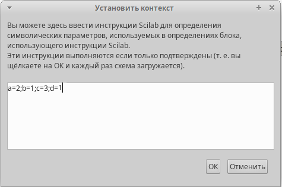{#fig:001 width=70%}

## Реализация модели в xcos

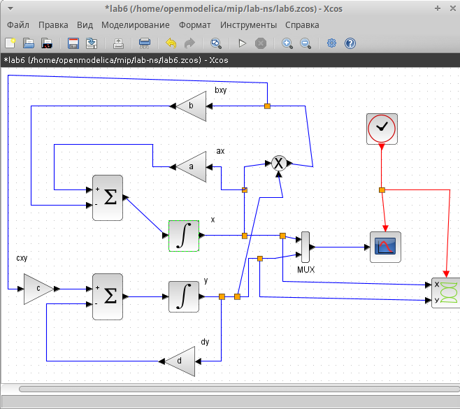{#fig:002 width=70%}

## Реализация модели в xcos

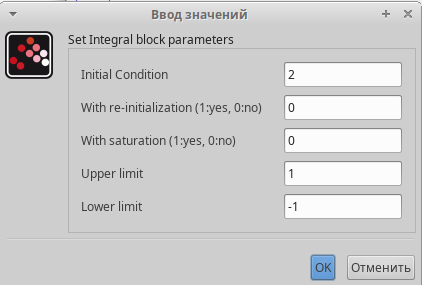{#fig:003 width=70%}

## Реализация модели в xcos

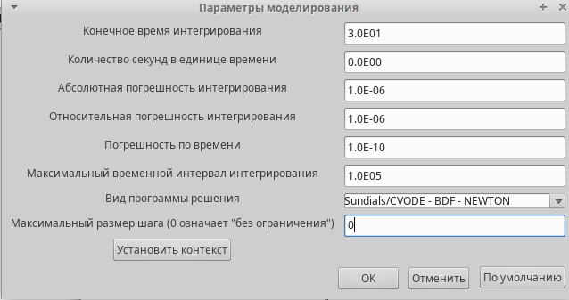{#fig:004 width=70%}

## Реализация модели в xcos

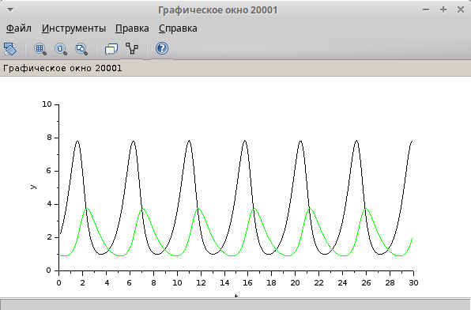{#fig:005 width=50%}

## Реализация модели в xcos

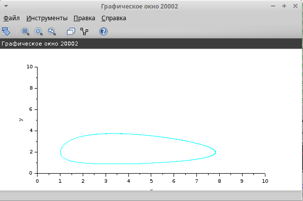{#fig:006 width=50%}

## Реализация модели с помощью блока Modelica в xcos

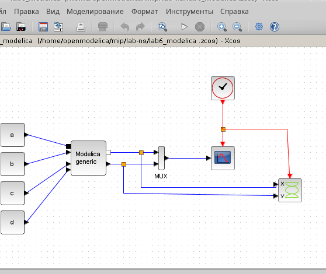{#fig:007 width=55%}

## Реализация модели с помощью блока Modelica в xcos

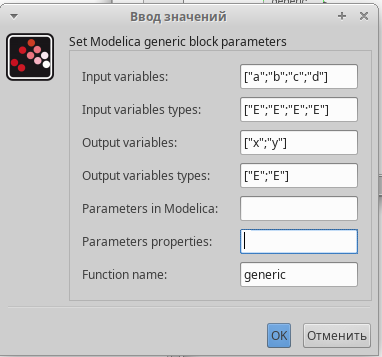{#fig:008 width=50%}

## Реализация модели с помощью блока Modelica в xcos

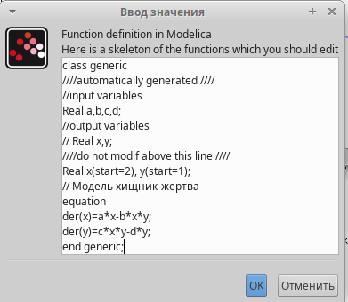{#fig:009 width=50%}

## Реализация модели с помощью блока Modelica в xcos

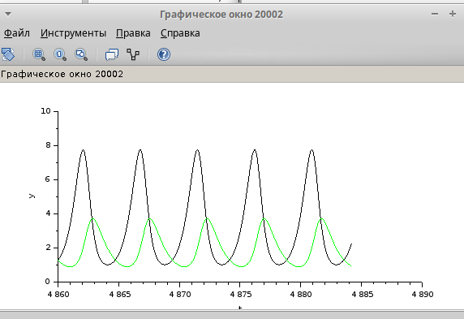{#fig:010 width=70%}

## Реализация модели с помощью блока Modelica в xcos

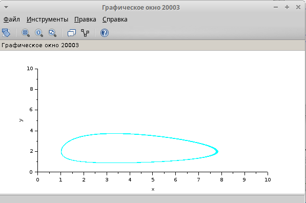{#fig:011 width=70%}

## Упражнение

```
  parameter Real a = 2;
  parameter Real b = 1;
  parameter Real c = 0.3;
  parameter Real d = 1;
  parameter Real x0 = 2;
  parameter Real y0 = 1;
  Real x(start=x0);
  Real y(start=y0);
equation
    der(x) = a*x - b*x*y;
    der(y) = c*x*y - d*y;
```

## Упражнение

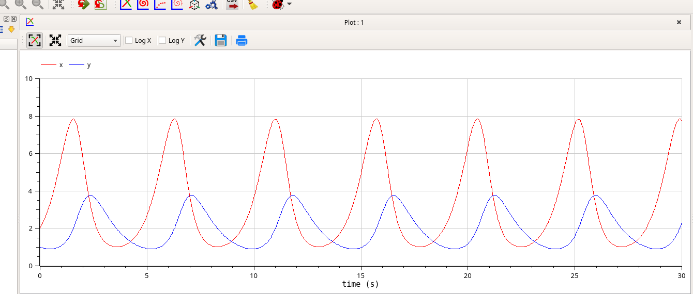{#fig:012 width=70%}

## Упражнение

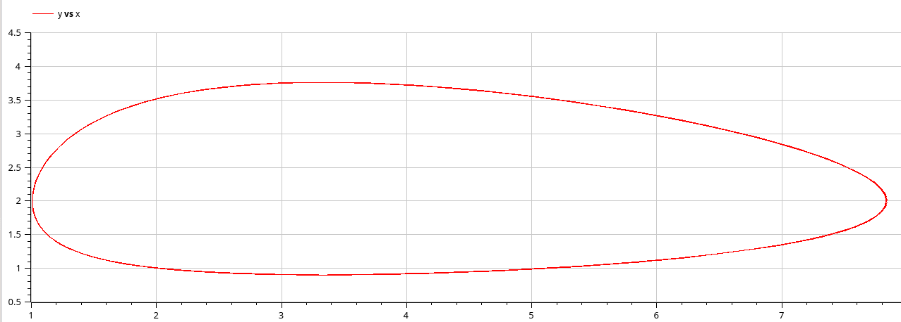{#fig:013 width=70%}

## Выводы

В процессе выполнения данной лабораторной реализована модель "хищник-жертва" в *xcos*.
