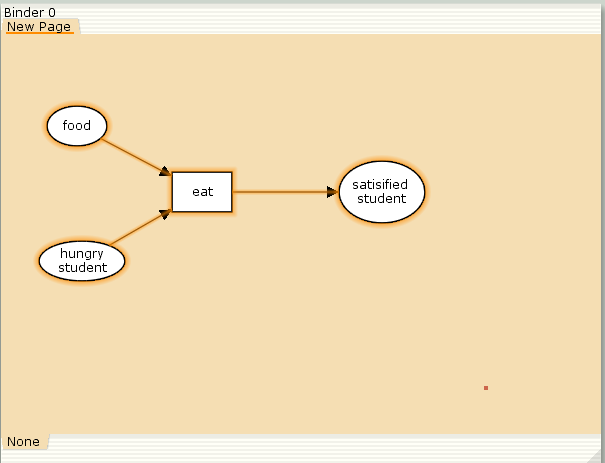
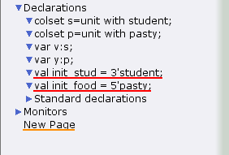
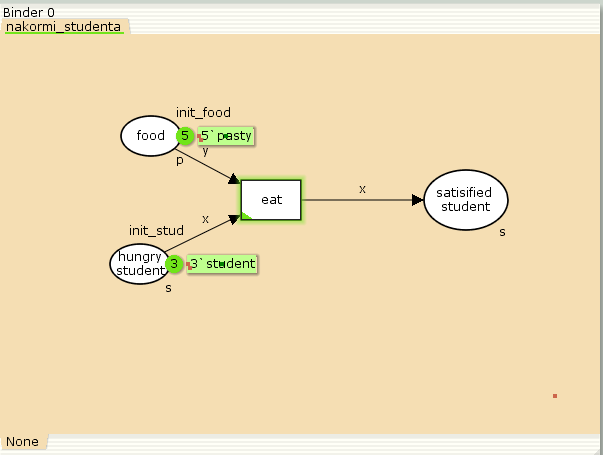
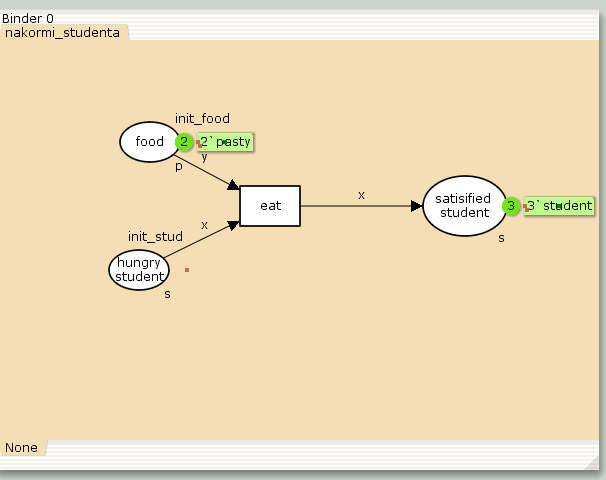
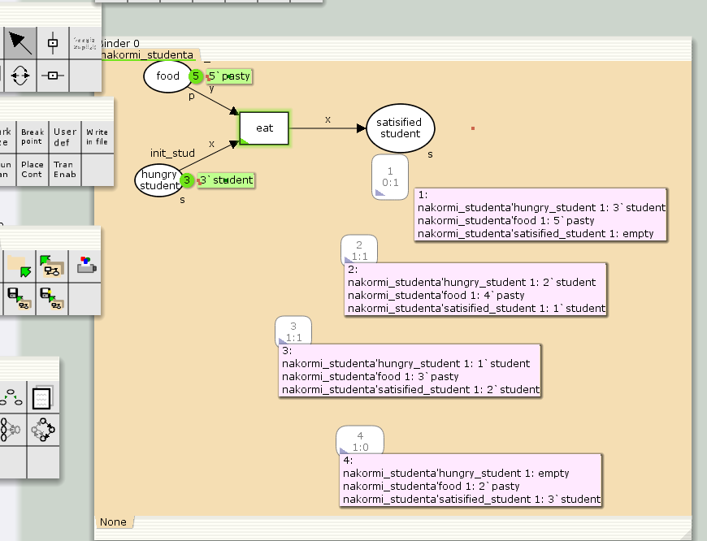

---
## Front matter
lang: ru-RU
title: Лабораторная работа 9
subtitle: Модель «Накорми студентов
author:
   - Алади П. Ч.
institute:
  - Российский университет дружбы народов, Москва, Россия


## i18n babel
babel-lang: russian
babel-otherlangs: english

## Formatting pdf
toc: false
toc-title: Содержание
slide_level: 2
aspectratio: 169
section-titles: true
theme: metropolis
header-includes:
 - \metroset{progressbar=frametitle,sectionpage=progressbar,numbering=fraction}
---

# Информация

## Докладчик

:::::::::::::: {.columns align=center}
::: {.column width="70%"}

  
  * Алади Принц Чисом
  * студент
  * Российский университет дружбы народов
  * [103225007@pfur.ru](mailto:1032225007@pfur.ru)
  * <https://pjosh456.github.io/>

:::
::: {.column width="25%"}

:::
::::::::::::::

## Введение

**Цель работы**

Реализовать модель "Накорми студентов" в CPN Tools.

**Задание**

- Реализовать модель "Накорми студентов" в CPN Tools;
- Вычислить пространство состояний, сформировать отчет о нем и построить граф.

## Выполнение лабораторной работы

Рассмотрим пример студентов, обедающих пирогами. Голодный студент становится сытым после того, как съедает пирог.

Таким образом, имеем:

- два типа фишек: «пироги» и «студенты»;
- три позиции: «голодный студент», «пирожки», «сытый студент»;
- один переход: «съесть пирожок».

## Выполнение лабораторной работы

{#fig:001 width=70%}

## Выполнение лабораторной работы

{#fig:002 width=70%}

## Выполнение лабораторной работы

{#fig:003 width=50%}

## Выполнение лабораторной работы

{#fig:004 width=70%}

## Упражнение

```
 Statistics
------------------------------------------------------------------------
  State Space
     Nodes:  4
     Arcs:   3
     Secs:   0
     Status: Full

  Scc Graph
     Nodes:  4
     Arcs:   3
     Secs:   0
```

## Упражнение

```
 Boundedness Properties
------------------------------------------------------------------------
  Best Integer Bounds
                             Upper      Lower
     nakormi_studenta'food 1 5          2
     nakormi_studenta'hungry_student 1
                             3          0
     nakormi_studenta'satisfied_student 1
                             3          0
```

## Упражнение

{#fig:005 width=50%}

## Выводы

В процессе выполнения данной лабораторной работы я реализовал модель "Накорми студентов" в CPN Tools.

