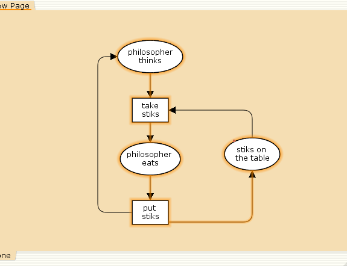
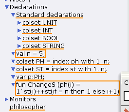
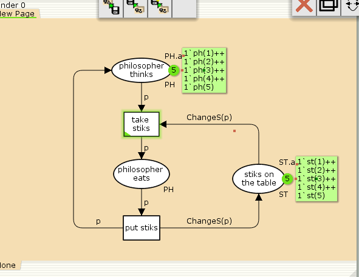
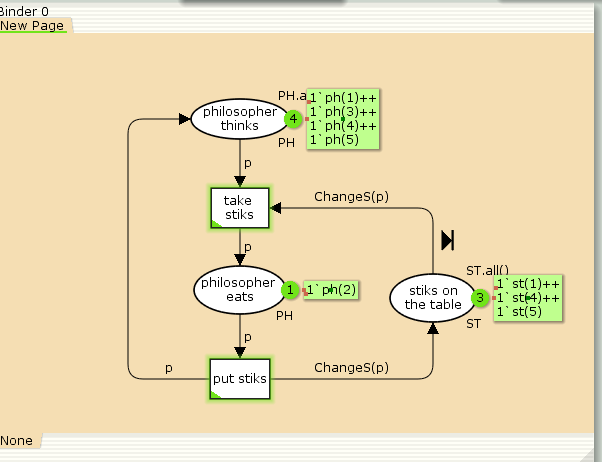
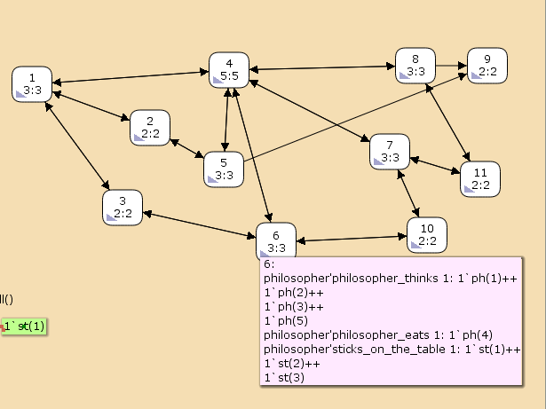

---
## Front matter
lang: ru-RU
title: Лабораторная работа 10
subtitle: Задача об обедающих мудрецах
author:
   - Алади П. Ч.
institute:
  - Российский университет дружбы народов, Москва, Россия

## i18n babel
babel-lang: russian
babel-otherlangs: english

## Formatting pdf
toc: false
toc-title: Содержание
slide_level: 2
aspectratio: 169
section-titles: true
theme: metropolis
header-includes:
 - \metroset{progressbar=frametitle,sectionpage=progressbar,numbering=fraction}
---

# Информация

## Докладчик

:::::::::::::: {.columns align=center}
::: {.column width="70%"}

 * Алади Принц Чисом
  * студент
  * Российский университет дружбы народов
  * [103225007@pfur.ru](mailto:1032225007@pfur.ru)
  * <https://pjosh456.github.io/>
  
:::
::: {.column width="25%"}

:::
::::::::::::::
# Введение

**Цель работы**

Реализовать модель задачи об обедающих мудрецах в CPN Tools.

**Задание**

- Реализовать модель задачи об обедающих мудрецах  в CPN Tools;
- Вычислить пространство состояний, сформировать отчет о нем и построить граф.

## Выполнение лабораторной работы

**Постановка задачи**

Пять мудрецов сидят за круглым столом и могут пребывать в двух состояниях --
думать и есть. Между соседями лежит одна палочка для еды. Для приёма пищи
необходимы две палочки. Палочки -- пересекающийся ресурс. Необходимо синхронизировать процесс еды так, чтобы мудрецы не умерли с голода. 

## Выполнение лабораторной работы

{#fig:001 width=50%}

## Выполнение лабораторной работы

{#fig:002 width=60%}

## Выполнение лабораторной работы

{#fig:003 width=50%}

## Выполнение лабораторной работы

{#fig:004 width=50%}

## Упражнение

```
 Statistics
------------------------------------------------------------------------

  State Space
     Nodes:  11
     Arcs:   30
     Secs:   0
     Status: Full

  Scc Graph
     Nodes:  1
     Arcs:   0
     Secs:   0
```

## Упражнение

```
 Boundedness Properties
------------------------------------------------------------------------

  Best Integer Bounds
                             Upper      Lower
     philosopher'philosopher_eats 1
                             2          0
     philosopher'philosopher_thinks 1
                             5          3
     philosopher'sticks_on_the_table 1
                             5          1
```

## Упражнение

{#fig:005 width=60%}

## Выводы

В процессе выполнения данной лабораторной работы я реализовал модель задачи об обедающих мудрецах в CPN Tools.
