---
## Front matter
lang: ru-RU
title: Лабораторная работа №11
subtitle: Модель системы массового обслуживания $M|M|1$
author:
   - Алади П. Ч.
institute:
  - Российский университет дружбы народов, Москва, Россия

## i18n babel
babel-lang: russian
babel-otherlangs: english

## Formatting pdf
toc: false
toc-title: Содержание
slide_level: 2
aspectratio: 169
section-titles: true
theme: metropolis
header-includes:
 - \metroset{progressbar=frametitle,sectionpage=progressbar,numbering=fraction}
---

# Информация

## Докладчик

:::::::::::::: {.columns align=center}
::: {.column width="70%"}

* Алади Принц Чисом
  * студент
  * Российский университет дружбы народов
  * [103225007@pfur.ru](mailto:1032225007@pfur.ru)
  * <https://pjosh456.github.io/>
:::
::: {.column width="30%"}

:::
::::::::::::::

# Вводная часть

**Цель работы**

Реализовать модель $M|M|1$ в CPN tools.

**Задание**

- Реализовать в CPN Tools модель системы массового обслуживания M|M|1.
- Настроить мониторинг параметров моделируемой системы и нарисовать графики очереди.

## Выполнение лабораторной работы

**Постановка задачи**

В систему поступает поток заявок двух типов, распределённый по пуассоновскому
закону. Заявки поступают в очередь сервера на обработку. Дисциплина очереди -
FIFO. Если сервер находится в режиме ожидания (нет заявок на сервере), то заявка
поступает на обработку сервером.

## Выполнение лабораторной работы

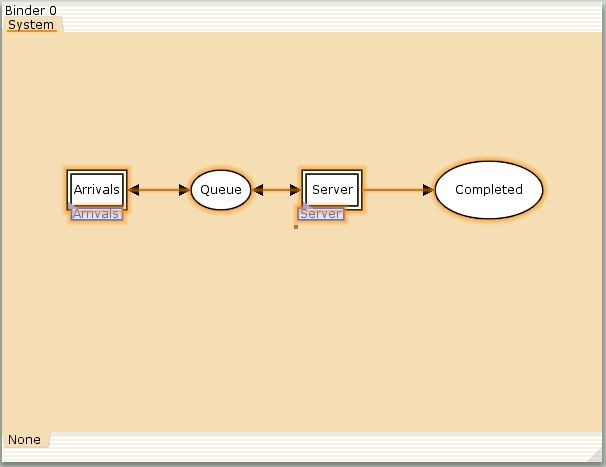{#fig:001 width=70%}

## Выполнение лабораторной работы

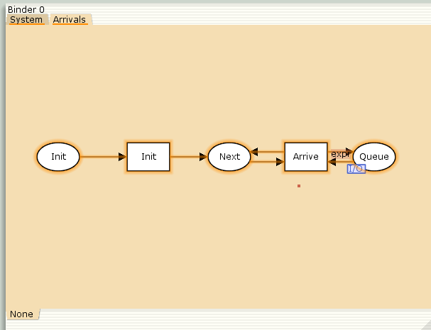{#fig:002 width=70%}

## Выполнение лабораторной работы

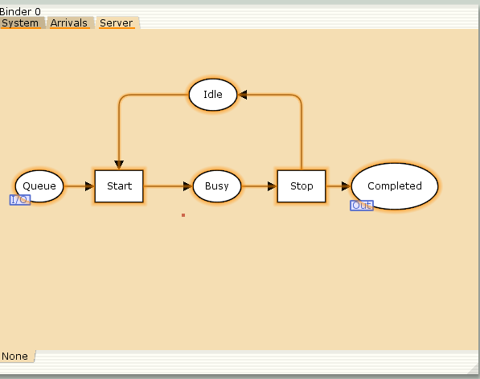{#fig:003 width=70%}

## Выполнение лабораторной работы

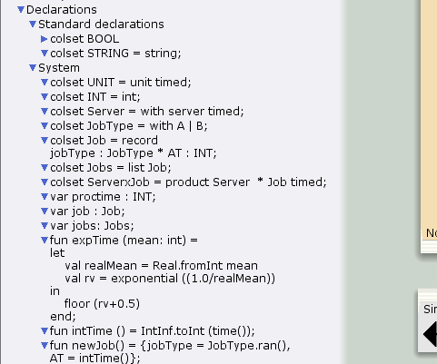{#fig:004 width=50%}

## Выполнение лабораторной работы

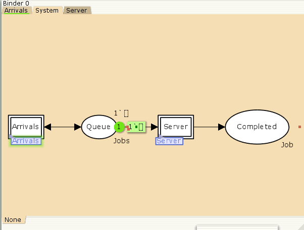{#fig:005 width=70%}

## Выполнение лабораторной работы

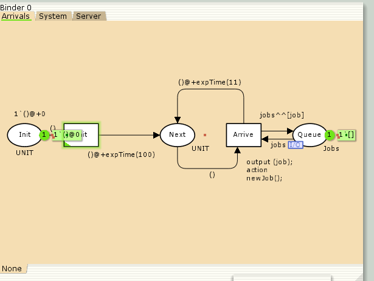{#fig:006 width=70%}

## Выполнение лабораторной работы

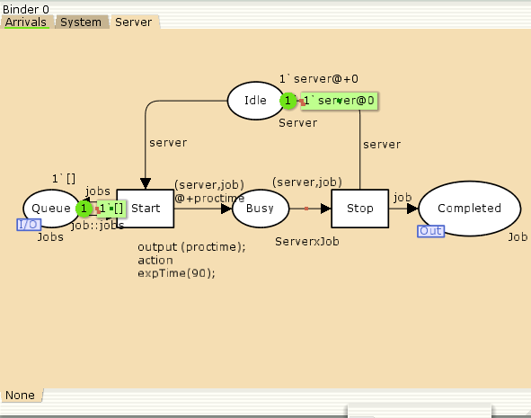{#fig:007 width=70%}

## Мониторинг параметров моделируемой системы

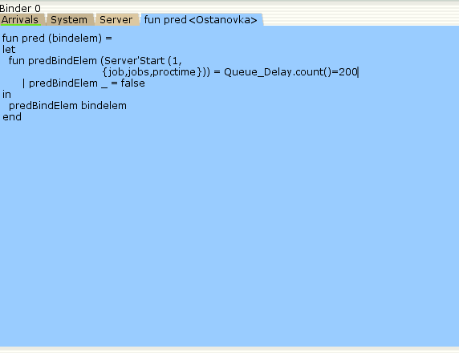{#fig:008 width=70%}

## Мониторинг параметров моделируемой системы

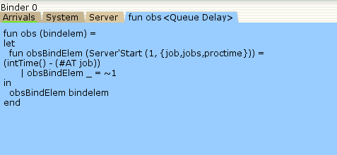{#fig:009 width=70%}

## Мониторинг параметров моделируемой системы 

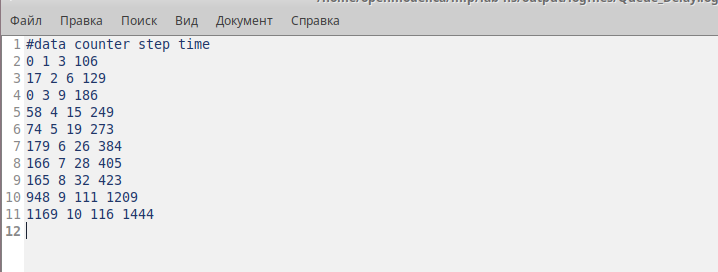{#fig:010 width=70%}

## Мониторинг параметров моделируемой системы

{#fig:011 width=60%}

## Мониторинг параметров моделируемой системы

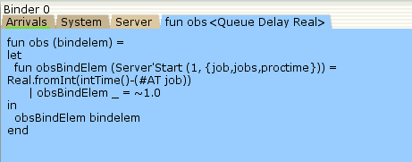{#fig:012 width=70%}

## Мониторинг параметров моделируемой системы

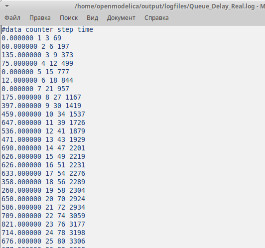{#fig:013 width=50%}

## Мониторинг параметров моделируемой системы

{#fig:014 width=70%}

## Мониторинг параметров моделируемой системы

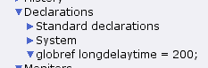{#fig:015 width=70%}

## Мониторинг параметров моделируемой системы

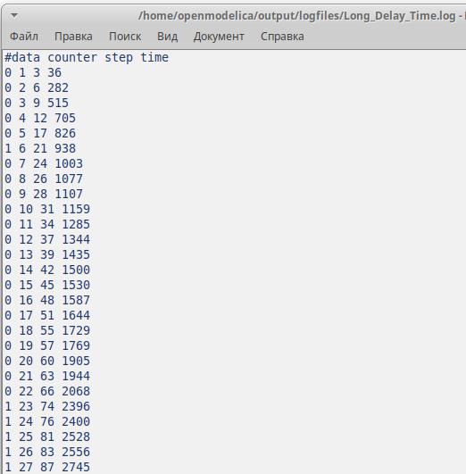{#fig:016 width=45%}

## Мониторинг параметров моделируемой системы

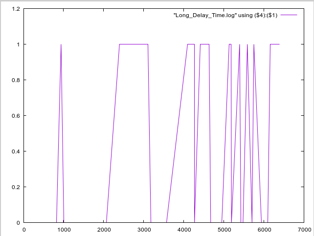{#fig:017 width=60%}

## Выводы

В процессе выполнения данной лабораторной работы я реализовала модель системы массового обслуживания $M|M|1$ в CPN Tools.

