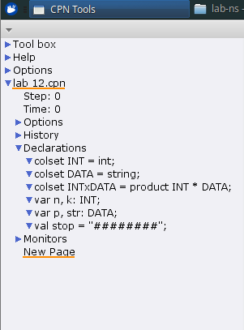
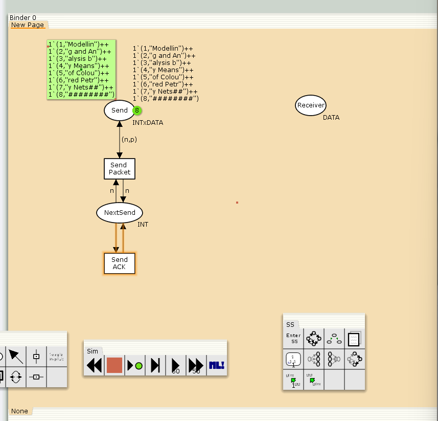
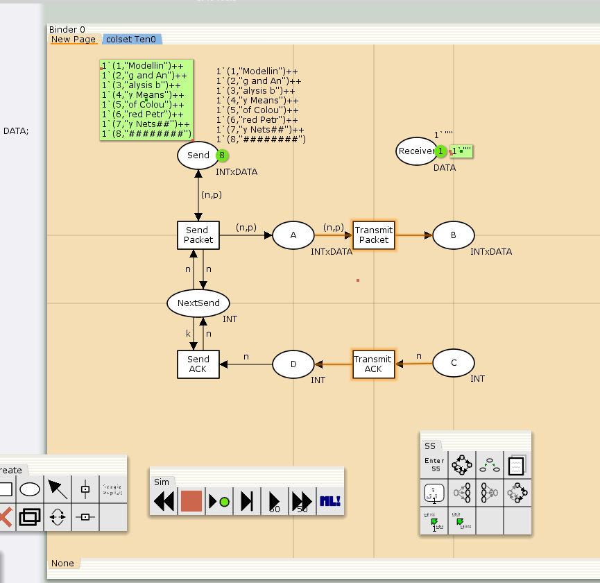
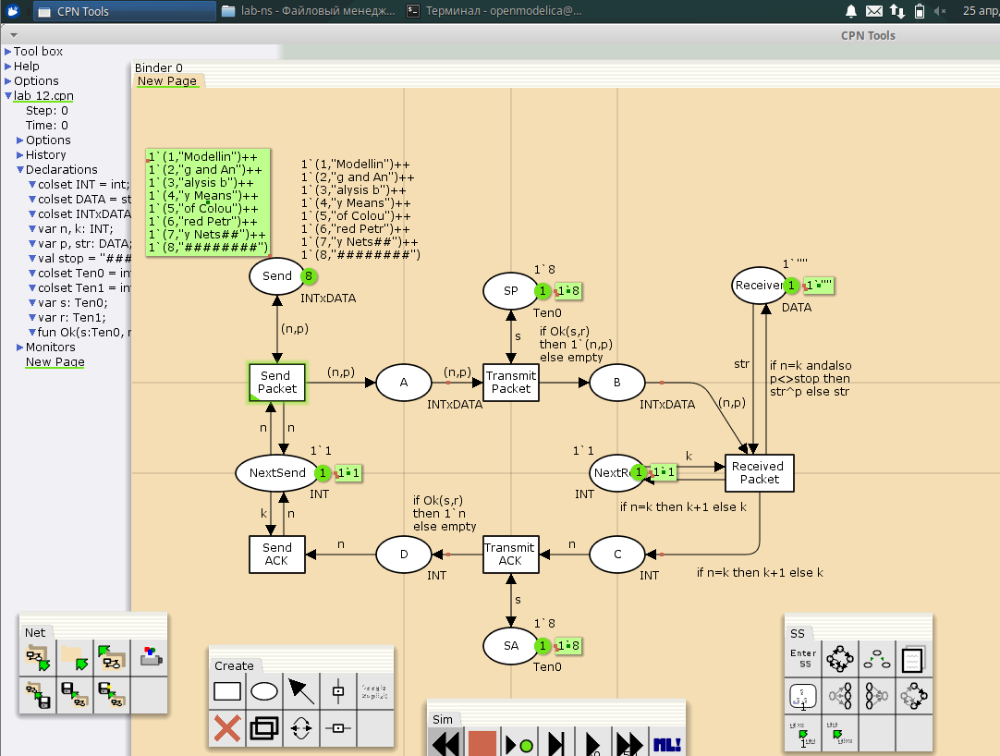
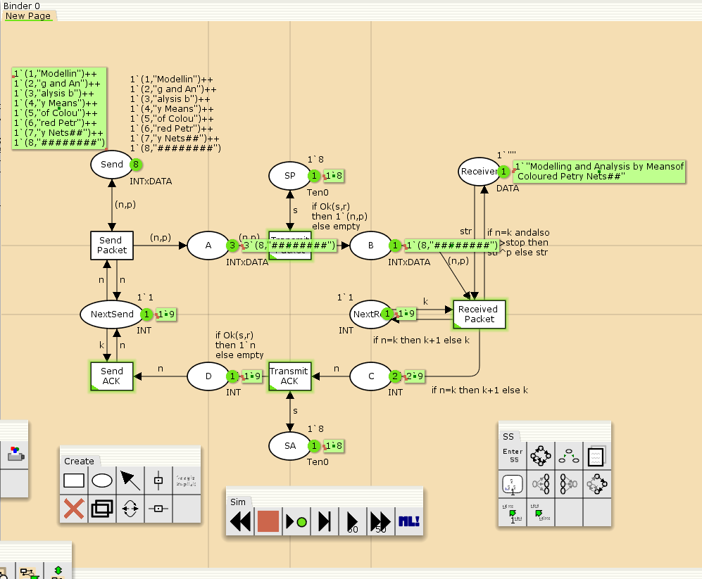
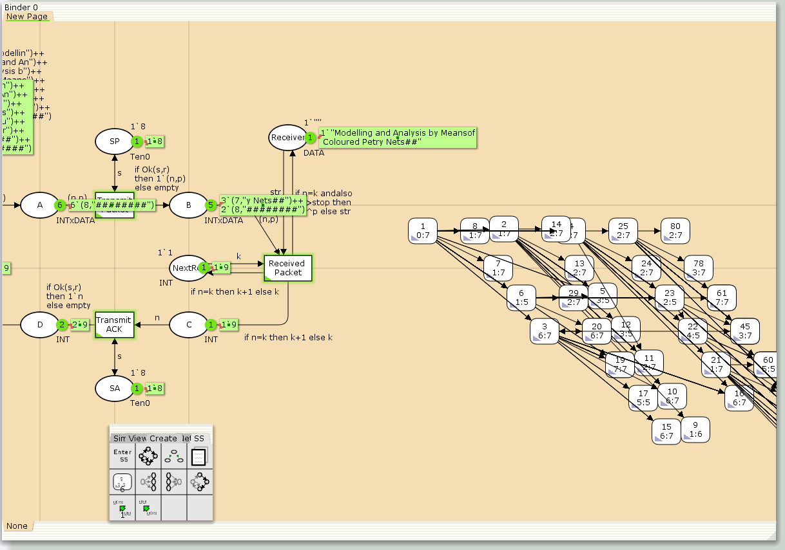

---
## Front matter
lang: ru-RU
title: Лабораторная работа 12
subtitle: Пример моделирования простого протокола передачи данных
author:
  - Алади П. Ч.
institute:
  - Российский университет дружбы народов, Москва, Россия
 
## i18n babel
babel-lang: russian
babel-otherlangs: english

## Formatting pdf
toc: false
toc-title: Содержание
slide_level: 2
aspectratio: 169
section-titles: true
theme: metropolis
header-includes:
 - \metroset{progressbar=frametitle,sectionpage=progressbar,numbering=fraction}
---

# Информация

## Докладчик

:::::::::::::: {.columns align=center}
::: {.column width="70%"}

  * Алади Принц Чисом
  * студент
  * Российский университет дружбы народов
  * [103225007@pfur.ru](mailto:1032225007@pfur.ru)
  * <https://pjosh456.github.io/>
:::
::: {.column width="30%"}

:::
::::::::::::::

## Цели и задачи

**Цель работы**

Реализовать простой протокол передачи данных в CPN Tools.

**Задание**

- Реализовать простой протокол передачи данных в CPN Tools.
- Вычислить пространство состояний, сформировать отчет о нем и построить граф.

## Выполнение лабораторной работы

{#fig:001 width=70%}

## Выполнение лабораторной работы

{#fig:002 width=60%}

## Выполнение лабораторной работы

{#fig:003 width=60%}

## Выполнение лабораторной работы

{#fig:004 width=70%}

## Выполнение лабораторной работы

{#fig:005 width=70%}

## Выполнение лабораторной работы

{#fig:006 width=70%}

## Упражнение

```
 Statistics
------------------------------------------------------------------------

  State Space
     Nodes:  6538
     Arcs:   122964
     Secs:   15
     Status: Partial

  Scc Graph
     Nodes:  6538
     Arcs:   122964
     Secs:   2
```

## Упражнение

```
 Boundedness Properties
------------------------------------------------------------------------

  Best Integer Bounds
                             Upper      Lower
     New_Page'A 1            6          0
     New_Page'B 1            11         0
     New_Page'C 1            12         0
     New_Page'D 1            14         0
     New_Page'NextRec 1      1          1
     New_Page'NextSend 1     1          1
     New_Page'Receiver 1     1          1
     New_Page'SA 1           1          1
     New_Page'SP 1           1          1
     New_Page'Send 1         8          8
```

## Упражнение

{#fig:007 width=70%}

## Выводы

В процессе выполнения данной лабораторной работы я реализовал простой протокол передачи данных в CPN Tools и проведен анализ его пространства состояний.
