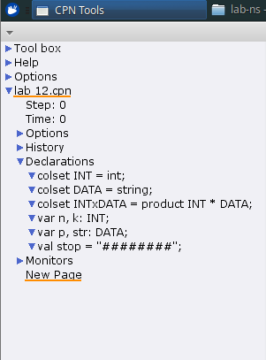
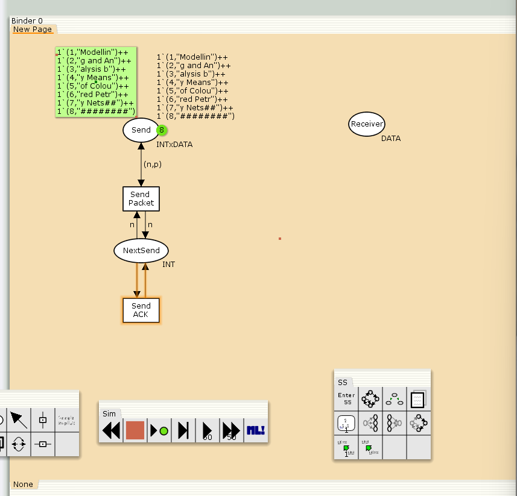
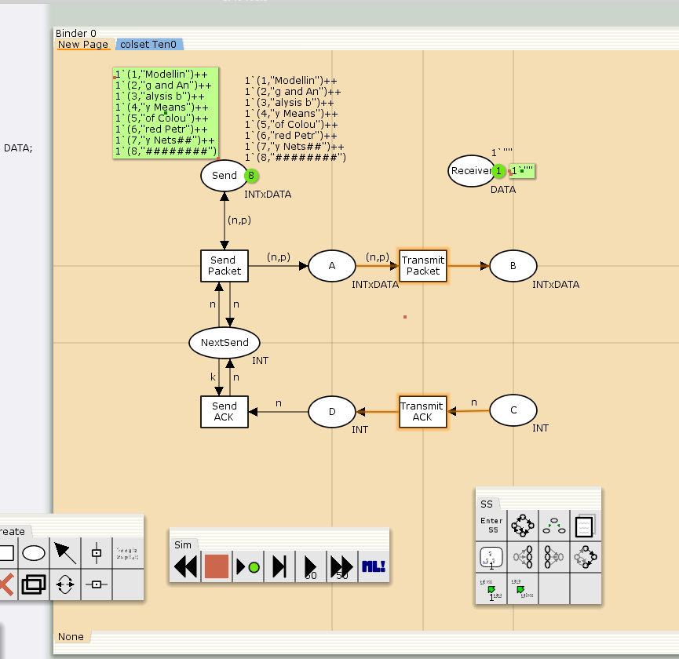
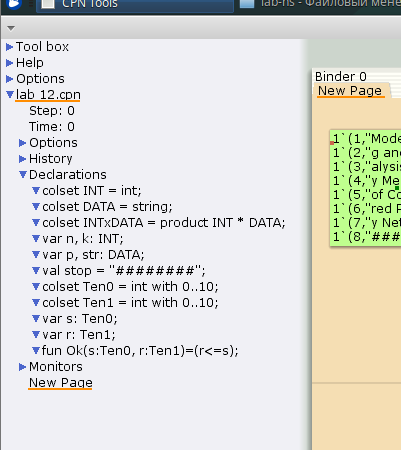
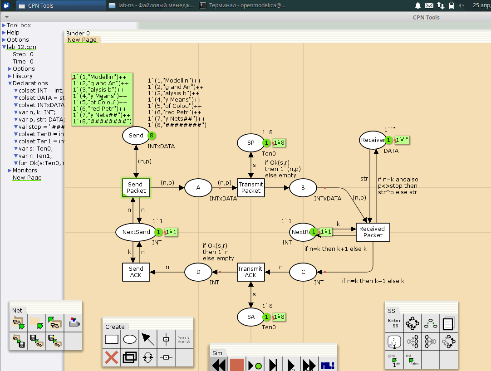
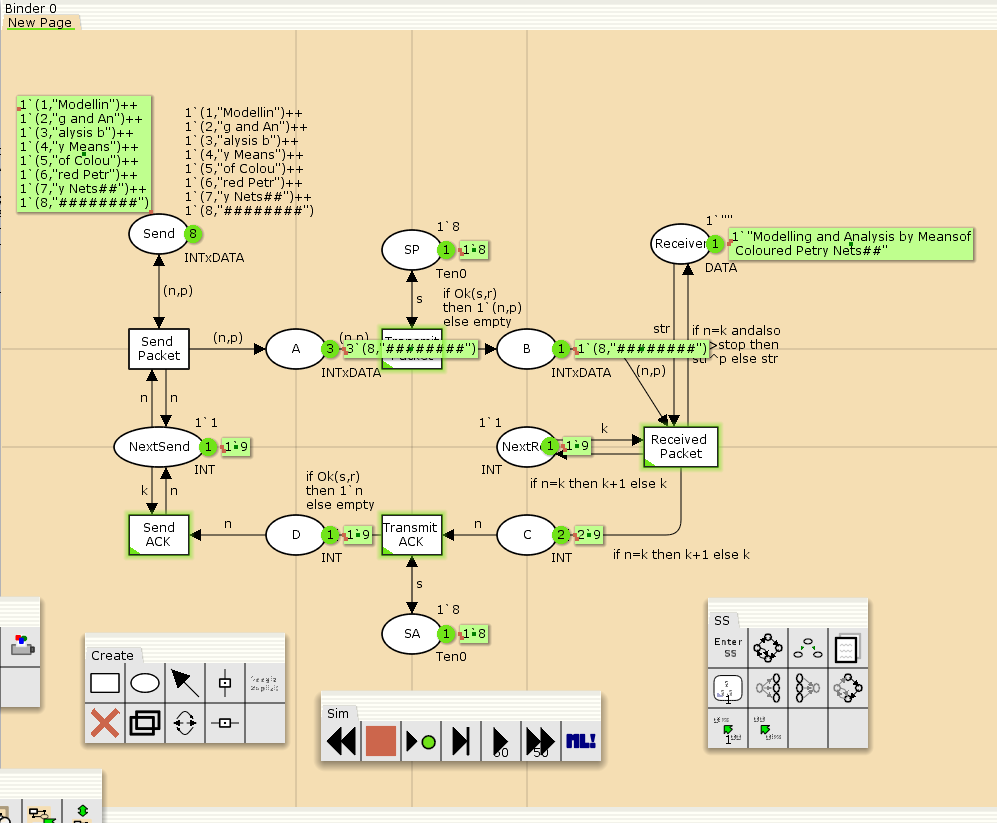
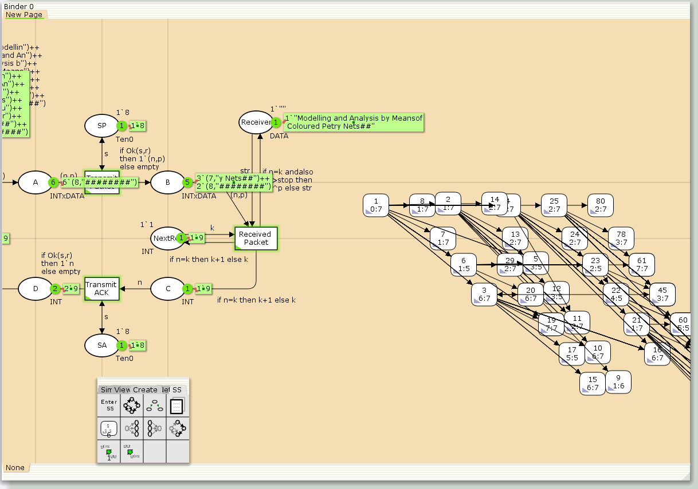

---
## Front matter
title: "Лабораторная работа 12"
subtitle: "Пример моделирования простого протокола передачи данных"
author: "Алади Принц Чисом"

## Generic otions
lang: ru-RU
toc-title: "Содержание"

## Bibliography
bibliography: bib/cite.bib
csl: pandoc/csl/gost-r-7-0-5-2008-numeric.csl

## Pdf output format
toc: true # Table of contents
toc-depth: 2
lof: true # List of figures
lot: true # List of tables
fontsize: 12pt
linestretch: 1.5
papersize: a4
documentclass: scrreprt
## I18n polyglossia
polyglossia-lang:
  name: russian
  options:
	- spelling=modern
	- babelshorthands=true
polyglossia-otherlangs:
  name: english
## I18n babel
babel-lang: russian
babel-otherlangs: english
## Fonts
mainfont: IBM Plex Serif
romanfont: IBM Plex Serif
sansfont: IBM Plex Sans
monofont: IBM Plex Mono
mathfont: STIX Two Math
mainfontoptions: Ligatures=Common,Ligatures=TeX,Scale=0.94
romanfontoptions: Ligatures=Common,Ligatures=TeX,Scale=0.94
sansfontoptions: Ligatures=Common,Ligatures=TeX,Scale=MatchLowercase,Scale=0.94
monofontoptions: Scale=MatchLowercase,Scale=0.94,FakeStretch=0.9
mathfontoptions:
## Biblatex
biblatex: true
biblio-style: "gost-numeric"
biblatexoptions:
  - parentracker=true
  - backend=biber
  - hyperref=auto
  - language=auto
  - autolang=other*
  - citestyle=gost-numeric
## Pandoc-crossref LaTeX customization
figureTitle: "Рис."
tableTitle: "Таблица"
listingTitle: "Листинг"
lofTitle: "Список иллюстраций"
lotTitle: "Список таблиц"
lolTitle: "Листинги"
## Misc options
indent: true
header-includes:
  - \usepackage{indentfirst}
  - \usepackage{float} # keep figures where there are in the text
  - \floatplacement{figure}{H} # keep figures where there are in the text
---

# Введение

## Цели и задачи

**Цель работы**

Реализовать простой протокол передачи данных в CPN Tools.

**Задание**

- Реализовать простой протокол передачи данных в CPN Tools.
- Вычислить пространство состояний, сформировать отчет о нем и построить граф.

# Выполнение лабораторной работы

Основные состояния: источник (Send), получатель (Receiver).
Действия (переходы): отправить пакет (Send Packet), отправить подтверждение (Send ACK).
Промежуточное состояние: следующий посылаемый пакет (NextSend).
Зададим декларации модели (рис. [-@fig:001]).

{#fig:001 width=70%}

Состояние Send имеет тип INTxDATA и следующую начальную маркировку (в соответствии с передаваемой фразой).

Стоповый байт ("########") определяет, что сообщение закончилось. Состояние Receiver имеет тип DATA и начальное значение 1'"" (т.е. пустая строка, поскольку состояние собирает данные и номер пакета его не интересует). Состояние NextSend имеет тип INT и начальное значение 1'1. Поскольку пакеты представляют собой кортеж, состоящий из номера пакета и строки, то выражение у двусторонней дуги будет иметь значение (n,p). Кроме того, необходимо взаимодействовать с состоянием, которое будет сообщать номер следующего посылаемого пакета данных. Поэтому переход Send Packet соединяем с состоянием NextSend двумя дугами с выражениями n (рис. 12.1). Также необходимо получать информацию с подтверждениями о получении данных. От перехода Send Packet к состоянию NextSend дуга с выражением n, обратно -- k.

Построим начальный граф(рис. [-@fig:002]):

{#fig:002 width=70%}

Зададим промежуточные состояния (A, B с типом INTxDATA, C, D с типом INTxDATA) для переходов (рис. 12.2): передать пакет Transmit Packet (передаём (n,p)), передать подтверждение Transmit ACK (передаём целое число k). Добавляем переход получения пакета (Receive Packet). От состояния Receiver идёт дуга к переходу Receive Packet со значением той строки (str), которая находится в состоянии Receiver. Обратно: проверяем, что номер пакета новый и строка не равна стоп-биту. Если это так, то строку добавляем к полученным данным. Кроме того, необходимо знать, каким будет номер следующего пакета. Для этого добавляем состояние NextRec с типом INT и начальным значением 1'1 (один пакет), связываем его дугами с переходом Receive Packet. Причём к переходу идёт дуга с выражением k, от перехода — if n=k then k+1 else k. Связываем состояния B и C с переходом Receive Packet. От состояния B к переходу Receive Packet — выражение (n,p), от перехода Receive Packet к состоянию C — выражение if n=k then k+1 else k. От перехода Receive Packet к состоянию Receiver: if n=k andalso p<>stop then str^p else str. (если n=k и мы не получили стоп-байт, то направляем в состояние строку и к ней прикрепляем p, в противном случае посылаем только строку).  На переходах Transmit Packet и Transmit ACK зададим потерю пакетов. Для этого на интервале от 0 до 10 зададим пороговое значение и, если передаваемое значение превысит этот порог, то считаем, что произошла потеря пакета, если нет, то передаём пакет дальше. Для этого задаём вспомогательные состояния SP и SA с типом Ten0 и начальным значением 1`8, соединяем с соответствующими переходами(рис. [-@fig:003]):

{#fig:003 width=70%}

В декларациях задаём(рис. [-@fig:004]):

{#fig:004 width=70%}

Таким образом, получим модель простого протокола передачи данных (рис. 12.3).
Пакет последовательно проходит: состояние Send, переход Send Packet, состояние A, с некоторой вероятностью переход Transmit Packet, состояние B, попадает
на переход Receive Packet, где проверяется номер пакета и если нет совпадения,
то пакет направляется в состояние Received, а номер пакета передаётся последовательно в состояние C, с некоторой вероятностью в переход Transmit ACK,
далее в состояние D, переход Receive ACK, состояние NextSend (увеличивая на 1
номер следующего пакета), переход Send Packet. Так продолжается до тех пор,
пока не будут переданы все части сообщения. Последней будет передана стоп-последовательность(рис. [-@fig:005]):

{#fig:005 width=70%}

{#fig:006 width=70%}

## Упражнение

Вычислим пространство состояний. Прежде, чем пространство состояний может быть вычислено и проанализировано, необходимо сформировать код пространства состояний. Этот код создается, когда используется инструмент Войти в пространство состояний. Вход в пространство состояний занимает некоторое время. Затем, если ожидается, что пространство состояний будет небольшим, можно просто применить инструмент Вычислить пространство состояний к листу, содержащему страницу сети. Сформируем отчёт о пространстве состояний и проанализируем его.  Чтобы сохранить отчет, необходимо применить инструмент Сохранить отчет о пространстве состояний к листу, содержащему страницу сети и ввести имя файла отчета.

Из него можно увидеть:

- 6538 состояний и 122964 переходов между ними.
- Указаны границы значений для каждого элемента: промежуточные состояния A, B, C(наибольшая верхняя граница у A, так как после него пакеты отбрасываются. Так как мы установили максимум 10, то у следующего состояния B верхняя граница -- 10), вспомогательные состояния SP, SA, NextRec, NextSend, Receiver(в них может находиться только один пакет) и состояние Send(в нем хранится только 8 элементов, так как мы задали их в начале и с ними никаких изменений не происходит).
- Указаны границы в виде мультимножеств.
- Маркировка home для всех состояний (в любую позицию можно попасть из любой другой маркировки).
- Маркировка dead равная [6255] -- это состояния, в которых нет включенных переходов.

```
CPN Tools state space report for:
/home/openmodelica/mip/lab-ns/lab 12.cpn
Report generated: Fri Apr 25 23:01:43 2025


 Statistics
------------------------------------------------------------------------

  State Space
     Nodes:  6538
     Arcs:   122964
     Secs:   15
     Status: Full

  Scc Graph
     Nodes:  6538
     Arcs:   122964
     Secs:   2


 Boundedness Properties
------------------------------------------------------------------------

  Best Integer Bounds
                             Upper      Lower
     New_Page'A 1            6          0
     New_Page'B 1            11         0
     New_Page'C 1            12         0
     New_Page'D 1            14         0
     New_Page'NextRec 1      1          1
     New_Page'NextSend 1     1          1
     New_Page'Receiver 1     1          1
     New_Page'SA 1           1          1
     New_Page'SP 1           1          1
     New_Page'Send 1         8          8

  Best Upper Multi-set Bounds
     New_Page'A 1        6`(8,"########")
     New_Page'B 1        3`(7,"y Nets##")++
8`(8,"########")
     New_Page'C 1        12`9
     New_Page'D 1        14`9
     New_Page'NextRec 1  1`9
     New_Page'NextSend 1 1`9
     New_Page'Receiver 1 1`"Modelling and Analysis by Meansof Coloured Petry Nets##"
     New_Page'SA 1       1`8
     New_Page'SP 1       1`8
     New_Page'Send 1     1`(1,"Modellin")++
1`(2,"g and An")++
1`(3,"alysis b")++
1`(4,"y Means")++
1`(5,"of Colou")++
1`(6,"red Petr")++
1`(7,"y Nets##")++
1`(8,"########")

  Best Lower Multi-set Bounds
     New_Page'A 1        empty
     New_Page'B 1        empty
     New_Page'C 1        empty
     New_Page'D 1        empty
     New_Page'NextRec 1  1`9
     New_Page'NextSend 1 1`9
     New_Page'Receiver 1 1`"Modelling and Analysis by Meansof Coloured Petry Nets##"
     New_Page'SA 1       1`8
     New_Page'SP 1       1`8
     New_Page'Send 1     1`(1,"Modellin")++
1`(2,"g and An")++
1`(3,"alysis b")++
1`(4,"y Means")++
1`(5,"of Colou")++
1`(6,"red Petr")++
1`(7,"y Nets##")++
1`(8,"########")


 Home Properties
------------------------------------------------------------------------

  Home Markings
     [6255]


 Liveness Properties
------------------------------------------------------------------------

  Dead Markings
     [6255]

  Dead Transition Instances
     New_Page'Send_Packet 1

  Live Transition Instances
     None


 Fairness Properties
------------------------------------------------------------------------
     No infinite occurrence sequences.
```


Сформируем начало графа пространства состояний, так как их много(рис. [-@fig:007]):

{#fig:007 width=70%}

# Выводы

В процессе выполнения данной лабораторной работы я реализовал простой протокол передачи данных в CPN Tools и проведен анализ его пространства состояний.
