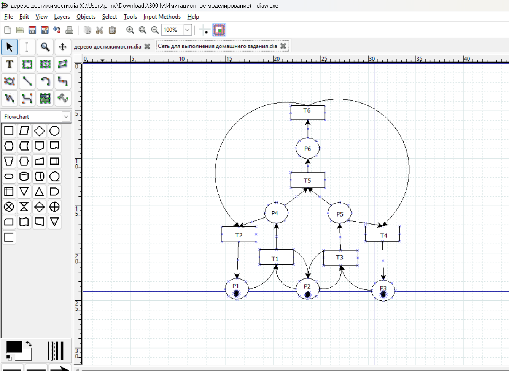
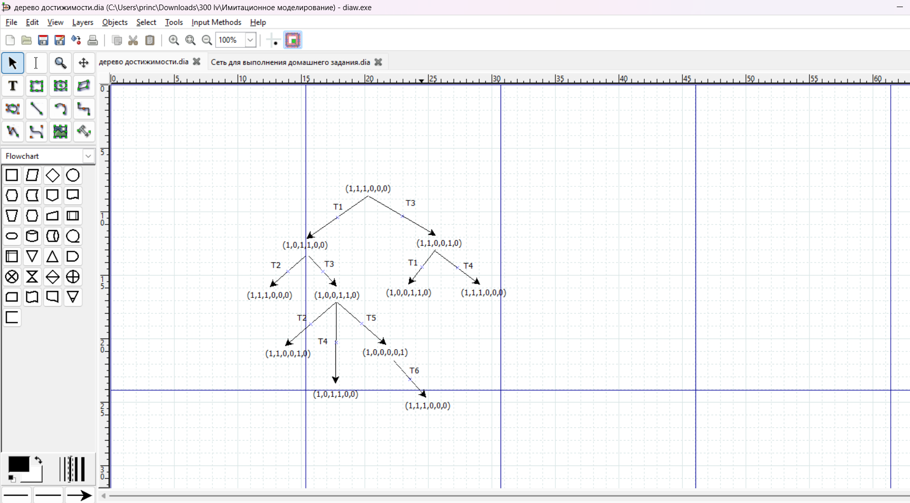
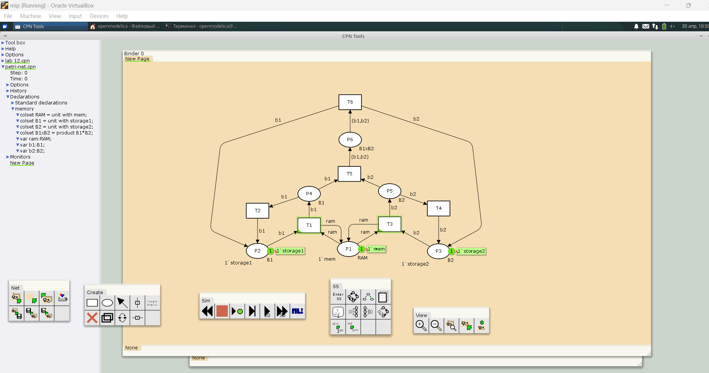
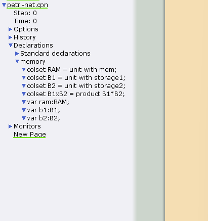
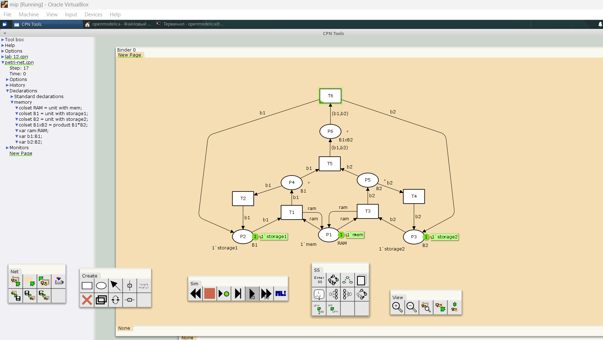
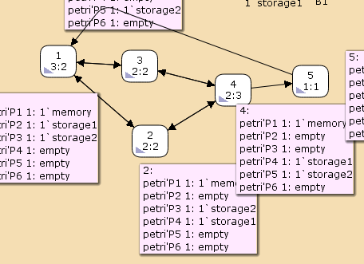

---
## Front matter
lang: ru-RU
title: Лабораторная работа 13
subtitle: Схема модели
author:
  - Алади П. Ч.
institute:
  - Российский университет дружбы народов, Москва, Россия

## i18n babel
babel-lang: russian
babel-otherlangs: english

## Formatting pdf
toc: false
toc-title: Содержание
slide_level: 2
aspectratio: 169
section-titles: true
theme: metropolis
header-includes:
 - \metroset{progressbar=frametitle,sectionpage=progressbar,numbering=fraction}
---

# Информация

## Докладчик

:::::::::::::: {.columns align=center}
::: {.column width="70%"}

  
  * Алади Принц Чисом
  * студент
  * Российский университет дружбы народов
  * [103225007@pfur.ru](mailto:1032225007@pfur.ru)
  * <https://pjosh456.github.io/>

:::
::: {.column width="30%"}

:::
::::::::::::::

## Постановка задачи

1. Используя теоретические методы анализа сетей Петри, провести анализ сети (с помощью построения дерева достижимости). Определить, является ли сеть безопасной, ограниченной, сохраняющей, имеются ли
тупики.
2. Промоделировать сеть Петри с помощью CPNTools.
3. Вычислить пространство состояний. Сформировать отчёт о пространстве состояний и проанализировать его.Построить граф пространства состояний.

## Описание модели

{#fig:001 width=40%}

## Анализ сети Петри

{#fig:002 width=50%}

## Реализация модели в CPN Tools

{#fig:003 width=70%}

## Реализация модели в CPN Tools

{#fig:004 width=50%}

## Реализация модели в CPN Tools

{#fig:005 width=70%}

## Пространство состояний

{#fig:006 width=70%}

## Пространство состояний

```
 Statistics
------------------------------------------------------------------------

  State Space
     Nodes:  5
     Arcs:   10
     Secs:   0
     Status: Full
```

## Выводы

В результате выполнения данной лабораторной работы я выполнила задание для самостоятельного выполнения, а именно провела анализ сети Петри, построила сеть в CPN Tools, построила граф состояний и провела его анализ.
