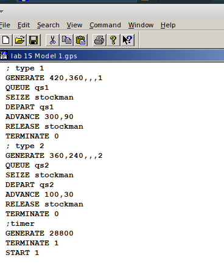
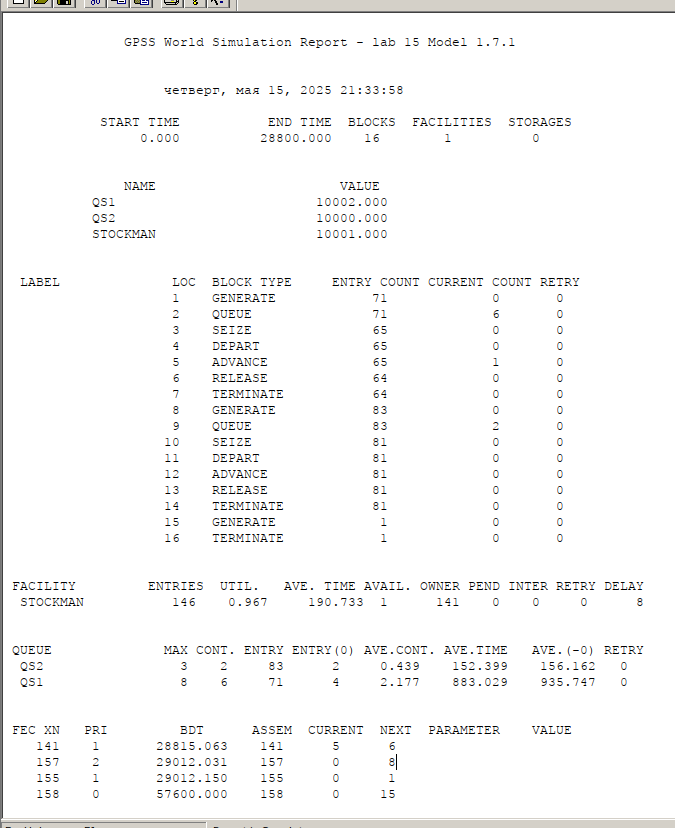
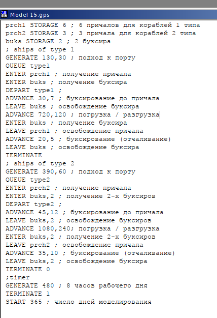
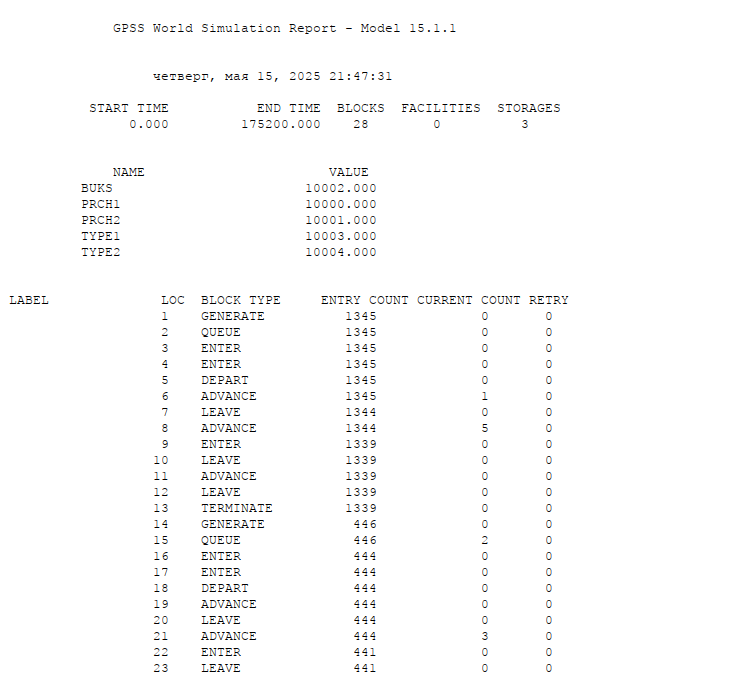
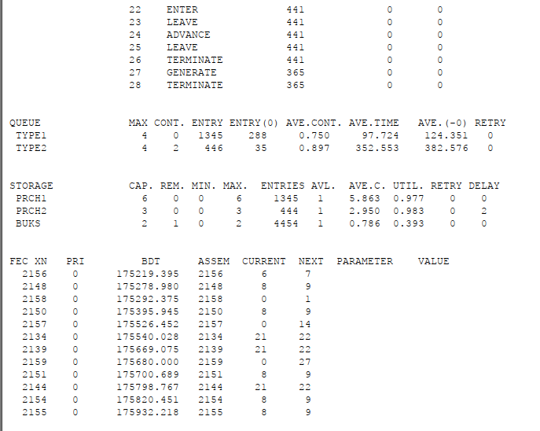

---
## Front matter
lang: ru-RU
title: Лабораторная работа 15
subtitle: Модели обслуживания с приоритетами
author:
 - Алади П. Ч.
institute:
 - Российский университет дружбы народов, Москва, Россия

## i18n babel
babel-lang: russian
babel-otherlangs: english

## Formatting pdf
toc: false
toc-title: Содержание
slide_level: 2
aspectratio: 169
section-titles: true
theme: metropolis
header-includes:
 - \metroset{progressbar=frametitle,sectionpage=progressbar,numbering=fraction}
---

# Информация

## Докладчик

:::::::::::::: {.columns align=center}
::: {.column width="70%"}

  * Алади Принц Чисом
  * студент
  * Российский университет дружбы народов
  * [103225007@pfur.ru](mailto:1032225007@pfur.ru)
  * <https://pjosh456.github.io/>

:::
::: {.column width="30%"}

:::
::::::::::::::

## Цель работы

Реализовать модели обслуживания с приоритетами и провести анализ результатов.

## Задание

Реализовать с помощью gpss:

- Модель обслуживания механиков на складе
- Модель обслуживания в порту судов двух типов

# Выполнение лабораторной работы

## Модель обслуживания механиков на складе

{#fig:001 width=40%}

## Модель обслуживания механиков на складе

{#fig:002 width=45%}

## Модель обслуживания в порту судов двух типов

{#fig:003 width=35%}

## Модель обслуживания в порту судов двух типов

{#fig:004 width=40%}

## Модель обслуживания в порту судов двух типов

{#fig:005 width=40%}

## Выводы

В результате выполнения работы были реализованы с помощью gpss:

- Модель обслуживания механиков на складе;
- Модель обслуживания в порту судов двух типов.

